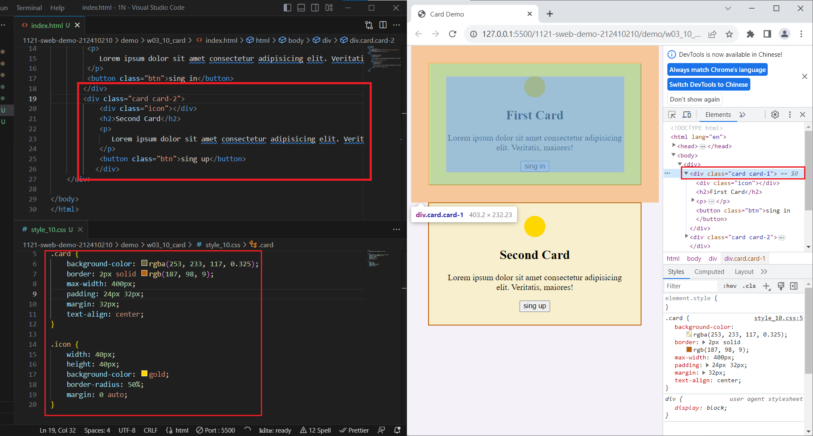
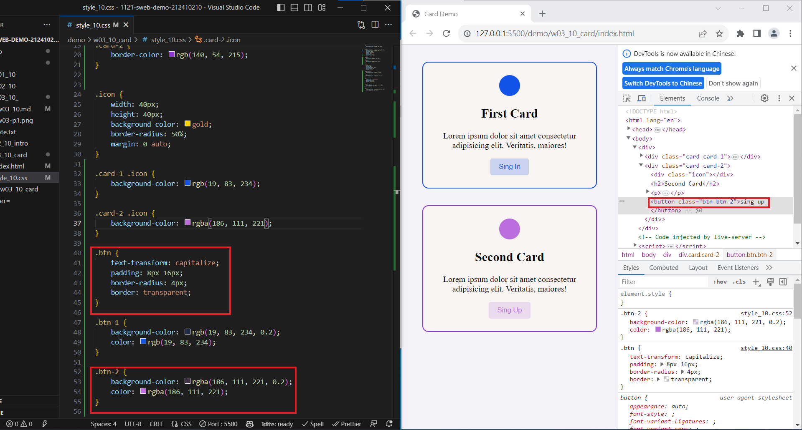
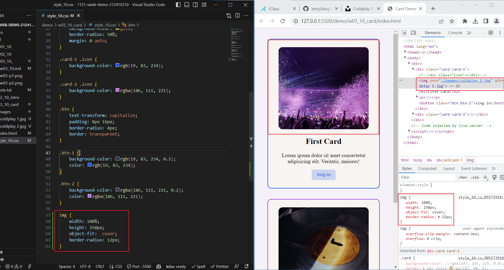
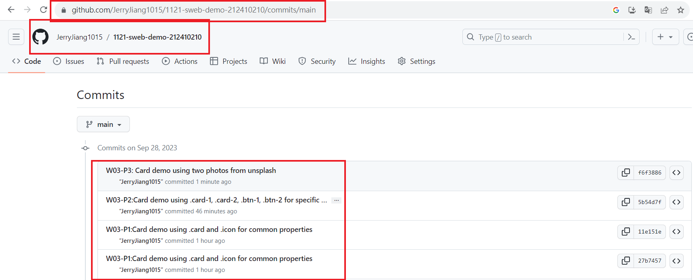

[My Github URL](https://github.com/JerryJiang1015/1121-sweb-demo-212410210.git)

### W03-P1:Card demo using .card and .icon for common properties



```
11e151e “JerryJiang1015” Thu Sep 28 19:32:53 2023 +0800  W03-P1:Card demo using .card and .icon for common properties
```

### W03-P2:Card demo using .card-1, .card-2, .btn-1, .btn-2 for specific properties



```
5b54d7f “JerryJiang1015” Thu Sep 28 20:16:36 2023 +0800  W03-P2:Card demo using .card-1, .card-2, .btn-1, .btn-2 for specific propertie
```

### W03-P3:Card demo using two photos from unsplash



```

```

### w03-P4: W3 git logs



```
git log --pretty=format:"%h%x09%an%x09%ad%x09%s" --after="2023-09-27"
```
