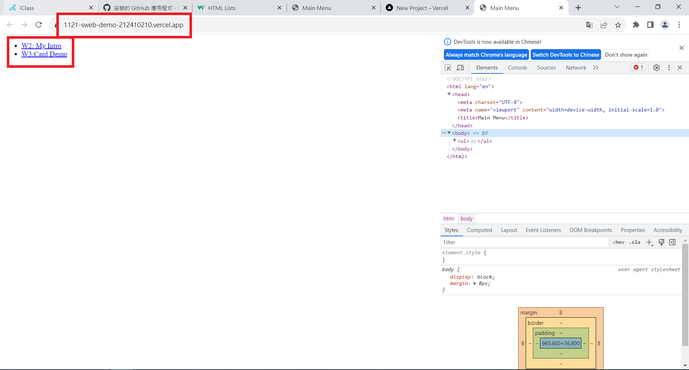

[My Github URL](https://github.com/JerryJiang1015/1121-sweb-demo-212410210.git)

### W04-P1:"W04-P1: add index.html in home directory"




```
7ca3537 “JerryJiang1015” Thu Oct 5 18:31:16 2023 +0800   W04-P1: add index.html in home directory
```

### W04-P2: Use css grid for two blogs locally


```

```

### W04-P3:


```

```

### W04-P4:


```
git log --pretty=format:"%h%x09%an%x09%ad%x09%s" --after="2023-10-04"

```
