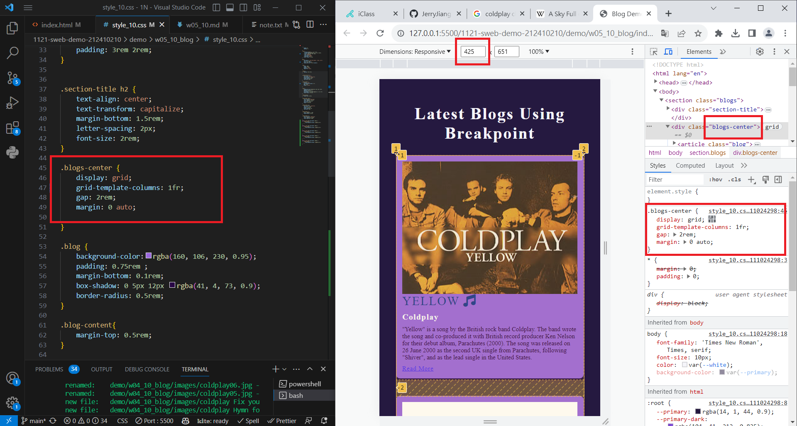
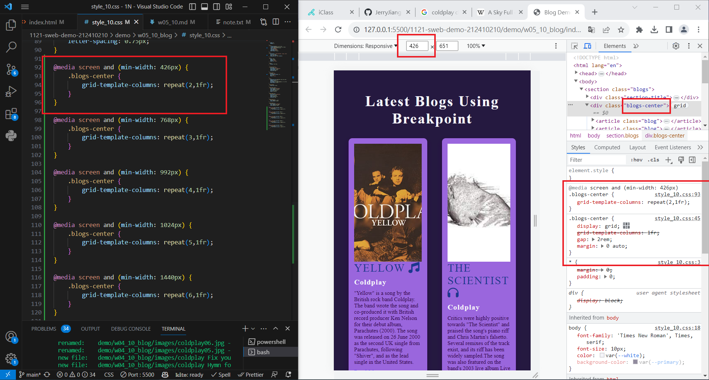
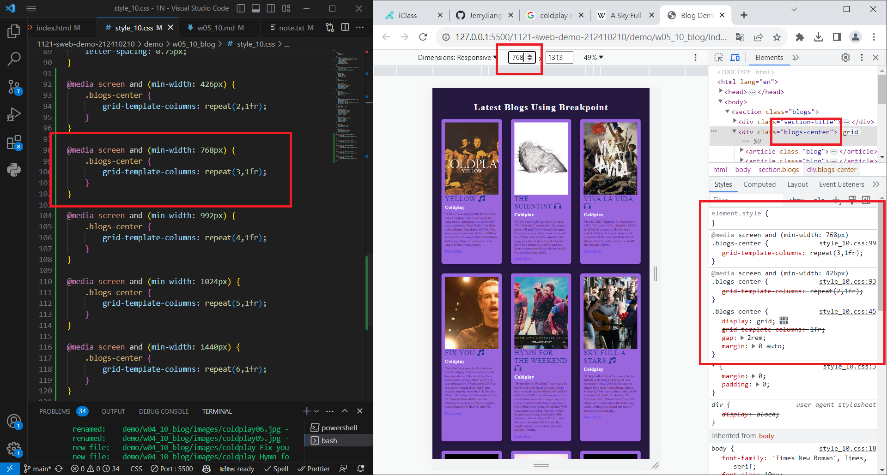
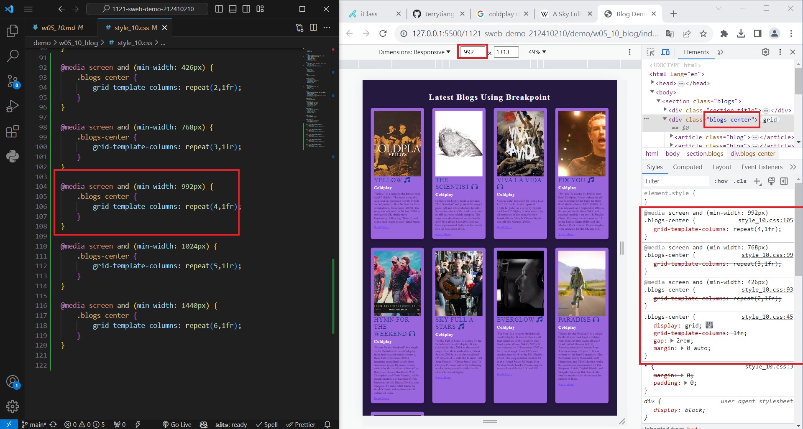
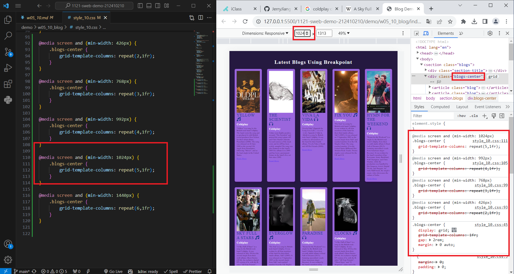
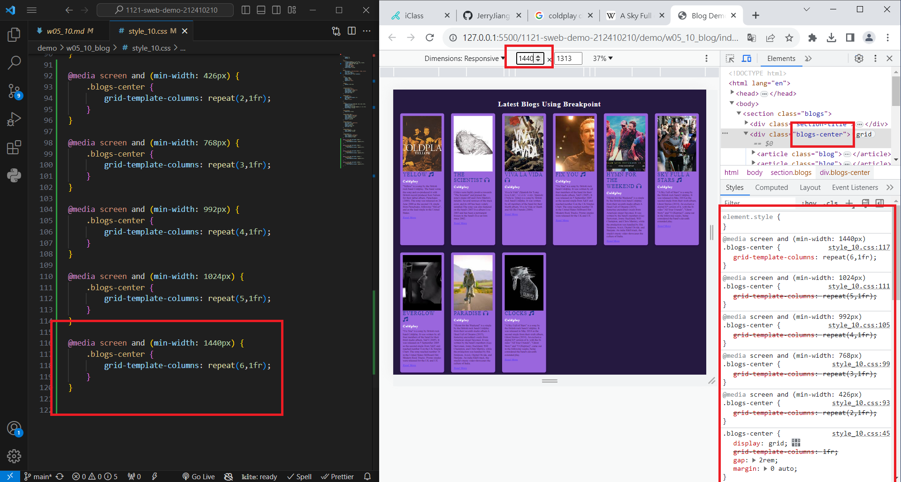
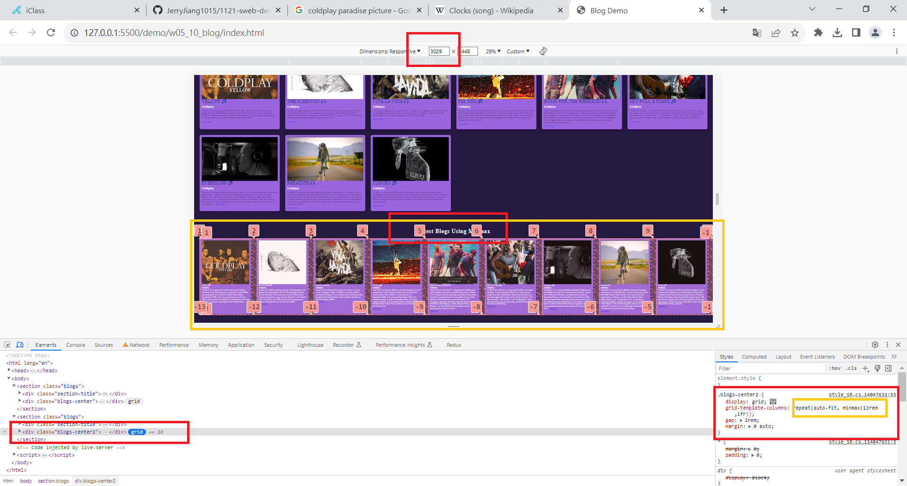
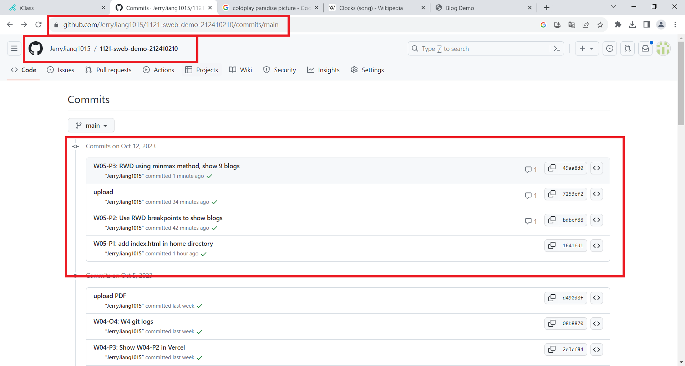

[My Github URL](https://github.com/JerryJiang1015/1121-sweb-demo-212410210.git)

### W05-P1:"W05-P1: add index.html in home directory"


```
1641fd1 “JerryJiang1015” Thu Oct 12 19:01:31 2023 +0800  W05-P1: add index.html in home directory
```

[vercel.app](https://1121-sweb-demo-212410210.vercel.app/)

### W05-P2: Use RWD breakpoints to show blogs













```
bdbcf88 “JerryJiang1015” Thu Oct 12 20:04:23 2023 +0800  W05-P2: Use RWD breakpoints to show blogs
```

[vercel.app](https://1121-sweb-demo-212410210.vercel.app/)

### W05-P3: RWD using minmax method, show 9 blogs



```
49aa8d0 “JerryJiang1015” Thu Oct 12 20:45:25 2023 +0800  W05-P3: RWD using minmax method, show 9 blogs
```

### W05-O4: W5 git logs



```
$ git log --pretty=format:"%h%x09%an%x09%ad%x09%s" --after="2023-10-11"
f3823db “JerryJiang1015”  Thu Oct 12 20:49:14 2023 +0800  W05-O4: W5 git logs
49aa8d0 “JerryJiang1015”  Thu Oct 12 20:45:25 2023 +0800  W05-P3: RWD using minmax method, show 9 blogs
7253cf2 “JerryJiang1015”  Thu Oct 12 20:11:51 2023 +0800  upload
bdbcf88 “JerryJiang1015”  Thu Oct 12 20:04:23 2023 +0800  W05-P2: Use RWD breakpoints to show blogs
1641fd1 “JerryJiang1015”  Thu Oct 12 19:01:31 2023 +0800  W05-P1: add index.html in home directory

```
