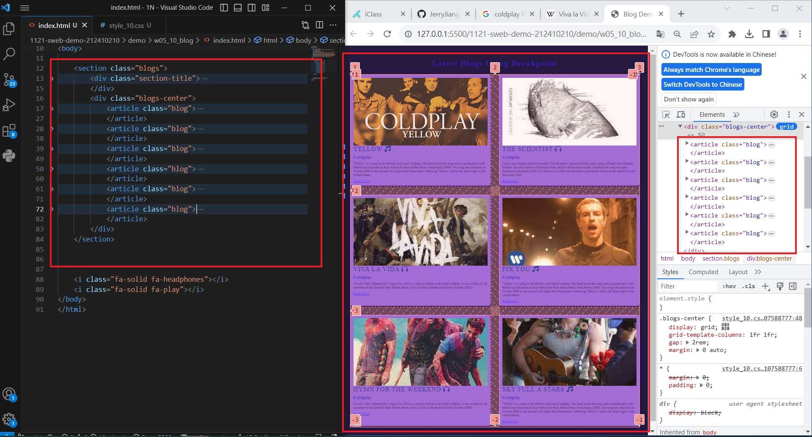

[My Github URL](https://github.com/JerryJiang1015/1121-sweb-demo-212410210.git)

### W05-P1:"W05-P1: add index.html in home directory"



```
7ca3537 “JerryJiang1015” Thu Oct 5 18:31:16 2023 +0800   W05-P1: add index.html in home directory
```

### W05-P2: Use css grid for two blogs locally


```
5dde6e8 “JerryJiang1015” Thu Oct 5 21:27:01 2023 +0800   W05-P2: Use css grid for two blogs locally
```

[vercel.app](https://1121-sweb-demo-212410210.vercel.app/)

### W05-P3: Show W05-P2 in Vercel


```
2e3cf84 “JerryJiang1015” Thu Oct 5 21:33:18 2023 +0800   W05-P3: Show W05-P2 in Vercel
```

### W05-O4: W4 git logs


```
git log --pretty=format:"%h%x09%an%x09%ad%x09%s" --after="2023-10-04"
2e3cf84 “JerryJiang1015” Thu Oct 5 21:33:18 2023 +0800   W05-P3: Show W05-P2 in Vercel
5dde6e8 “JerryJiang1015” Thu Oct 5 21:27:01 2023 +0800   W05-P2: Use css grid for two blogs locally
7ca3537 “JerryJiang1015” Thu Oct 5 18:31:16 2023 +0800   W05-P1: add index.html in home directory
```
