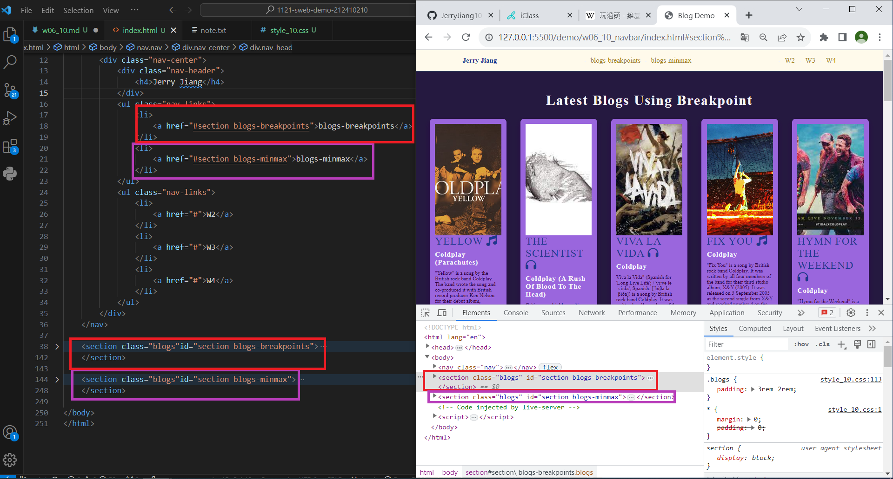
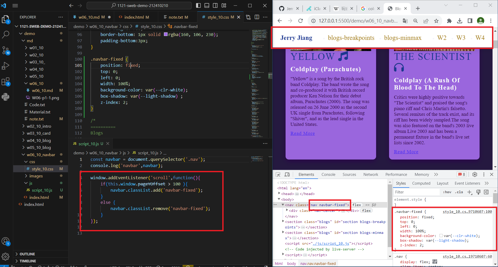
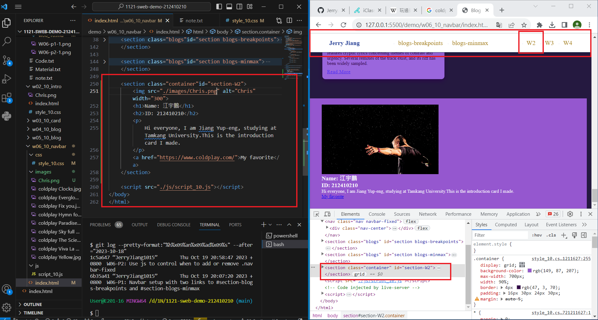
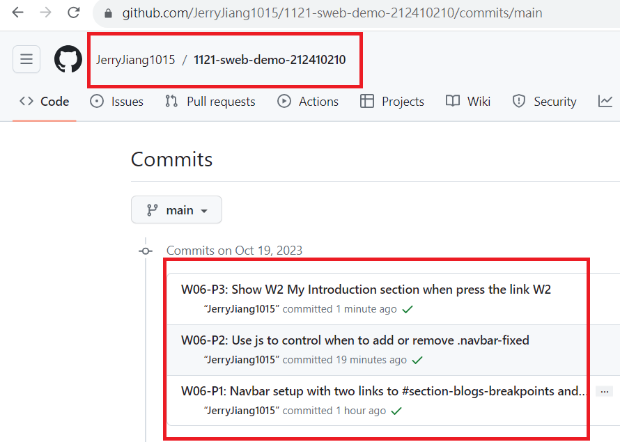

[My Github URL](https://github.com/JerryJiang1015/1121-sweb-demo-212410210.git)

### W06-P1: Navbar setup with two links to #section-blogs-breakpoints and #section-blogs-minmax



```
6b35a41 “JerryJiang1015” Thu Oct 19 20:07:20 2023 +0800  W06-P1: Navbar setup with two links to #section-blogs-breakpoints and #section-blogs-minmax
```

[vercel.app](https://1121-sweb-demo-212410210.vercel.app/)

### W06-P2: Use js to control when to add or remove .navbar-fixed



```
1c5a647 “JerryJiang1015” Thu Oct 19 20:58:47 2023 +0800  W06-P2: Use js to control when to add or remove .navbar-fixed
```

[vercel.app](https://1121-sweb-demo-212410210.vercel.app/)

### W06-P3: Show W2 My Introduction section when press the link W2



```
038d7b1 “JerryJiang1015” Thu Oct 19 21:17:23 2023 +0800  W06-P3: Show W2 My Introduction section when press the link W2
```

[vercel.app](https://1121-sweb-demo-212410210.vercel.app/)

### W06-O4: W6 git logs



```
$ git log --pretty=format:"%h%x09%an%x09%ad%x09%s" --after="2023-10-18"
038d7b1 “JerryJiang1015” Thu Oct 19 21:17:23 2023 +0800  W06-P3: Show W2 My Introduction section when press the link W2
6b35a41 “JerryJiang1015” Thu Oct 19 20:07:20 2023 +0800  W06-P1: Navbar setup with two links to #section-blogs-breakpoints and #section-blogs-minmax
1c5a647 “JerryJiang1015” Thu Oct 19 20:58:47 2023 +0800  W06-P2: Use js to control when to add or remove .navbar-fixed
```
