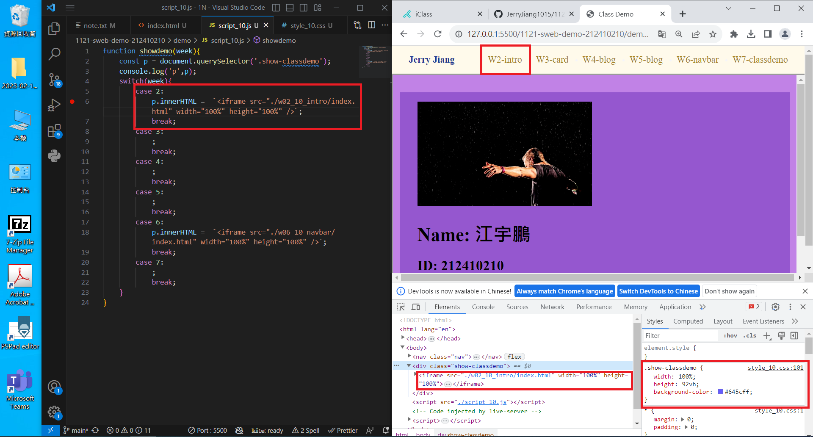

[My Github URL](https://github.com/JerryJiang1015/1121-sweb-demo-212410210.git)
[vercel.app](https://1121-sweb-demo-212410210.vercel.app/)

### W07-P1: Show classdemo of week 2 and week 6

### W2



### W6


```
ffc03f6 “JerryJiang1015” Thu Oct 26 19:23:49 2023 +0800  W07-P1: Show classdemo of week 2 and week 6
```

[vercel.app](https://1121-sweb-demo-212410210.vercel.app/)

### W07-P2: Show classdemo of week 7


```
27f6d19 “JerryJiang1015” Thu Oct 26 19:48:00 2023 +0800  W07-P2: Show classdemo of week 7
```

[vercel.app](https://1121-sweb-demo-212410210.vercel.app/)

### W07-P3: add index.html as home page with links of class demo, my Github and my Vercel


```
038d7b1 “JerryJiang1015” Thu Oct 19 21:17:23 2023 +0800  W07-P3: Show W2 My Introduction section when press the link W2
```

[vercel.app](https://1121-sweb-demo-212410210.vercel.app/)

### W07-O4: W6 git logs


```
$ git log --pretty=format:"%h%x09%an%x09%ad%x09%s" --after="2023-10-25"
ffc03f6 “JerryJiang1015” Thu Oct 26 19:23:49 2023 +0800  W07-P1: Show classdemo of week 2 and week 6
27f6d19 “JerryJiang1015” Thu Oct 26 19:48:00 2023 +0800  W07-P2: Show classdemo of week 7
```
