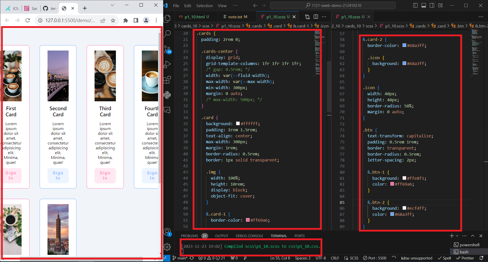
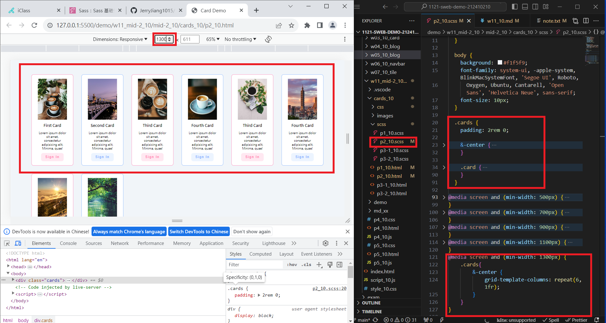
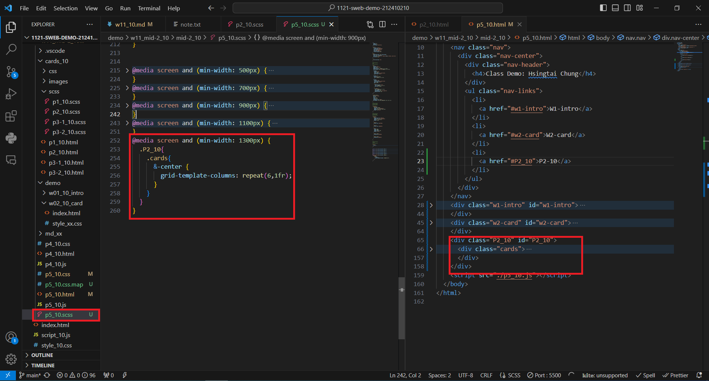
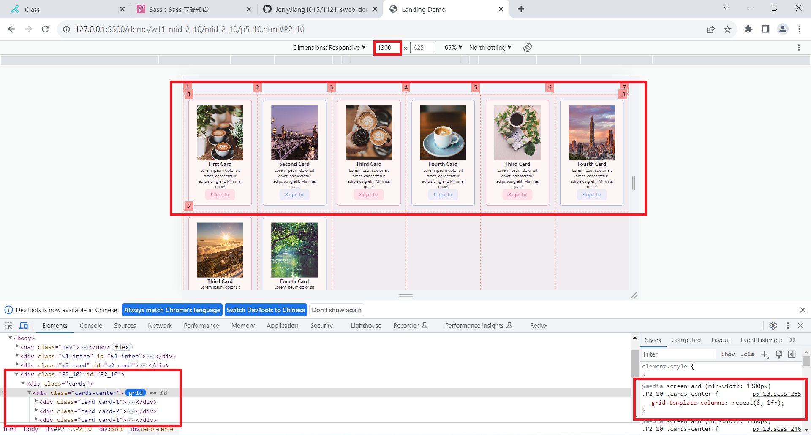
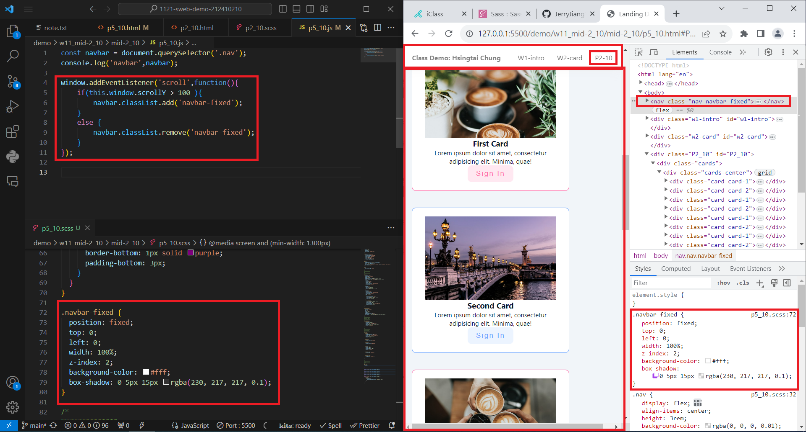
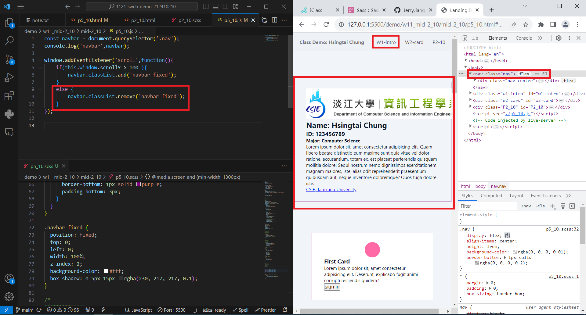
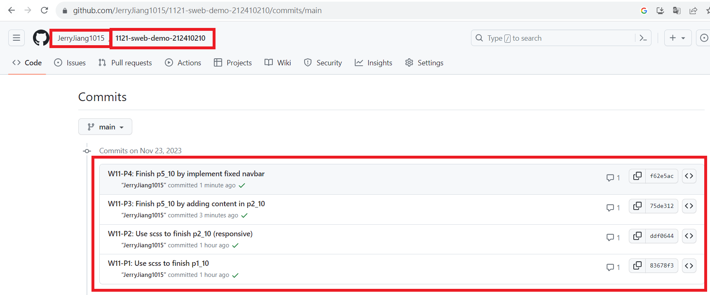

[My Github URL](https://github.com/JerryJiang1015/1121-sweb-demo-212410210.git)
[vercel.app](https://1121-sweb-demo-212410210.vercel.app/)

### W11-P1: Use scss to finish p1_10



```
83678f3 “JerryJiang1015” Thu Nov 23 19:17:26 2023 +0800  W11-P1: Use scss to finish p1_10
```

[vercel.app](https://1121-sweb-demo-212410210.vercel.app/)

### W11-P2: Use scss to finish p2_10 (responsive)



```
ddf0644 “JerryJiang1015” Thu Nov 23 20:06:51 2023 +0800  W11-P2: Use scss to finish p2_10 (responsive)
```

[vercel.app](https://1121-sweb-demo-212410210.vercel.app/)

### W11-P3: Finish p5_xx by adding content in p2_10





```
22e676f “JerryJiang1015” Thu Oct 26 20:26:29 2023 +0800  W11-P3: add index.html as home page with links of class demo, my Github and my Vercel
```

[vercel.app](https://1121-sweb-demo-212410210.vercel.app/)

### W11-P4: implement tiles layout as below





```
1f26752 “JerryJiang1015” Thu Oct 26 21:41:47 2023 +0800  W11-P4: implement tiles layout as below
```

[vercel.app](https://1121-sweb-demo-212410210.vercel.app/)

### W11-O5: W11 git logs



```
$ git log --pretty=format:"%h%x09%an%x09%ad%x09%s" --after="2023-10-25"
1f26752 “JerryJiang1015” Thu Oct 26 21:41:47 2023 +0800  W11-P4: implement tiles layout as below
22e676f “JerryJiang1015” Thu Oct 26 20:26:29 2023 +0800  W11-P3: add index.html as home page with links of class demo, my Github and my Vercel
ffc03f6 “JerryJiang1015” Thu Oct 26 19:23:49 2023 +0800  W11-P1: Show classdemo of week 2 and week 6
27f6d19 “JerryJiang1015” Thu Oct 26 19:48:00 2023 +0800  W11-P2: Show classdemo of week 7
```
