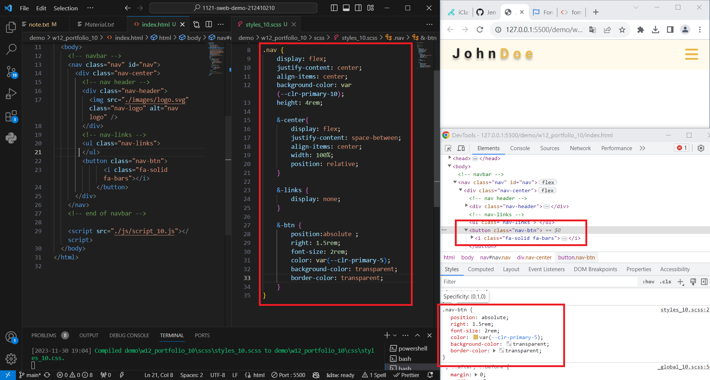
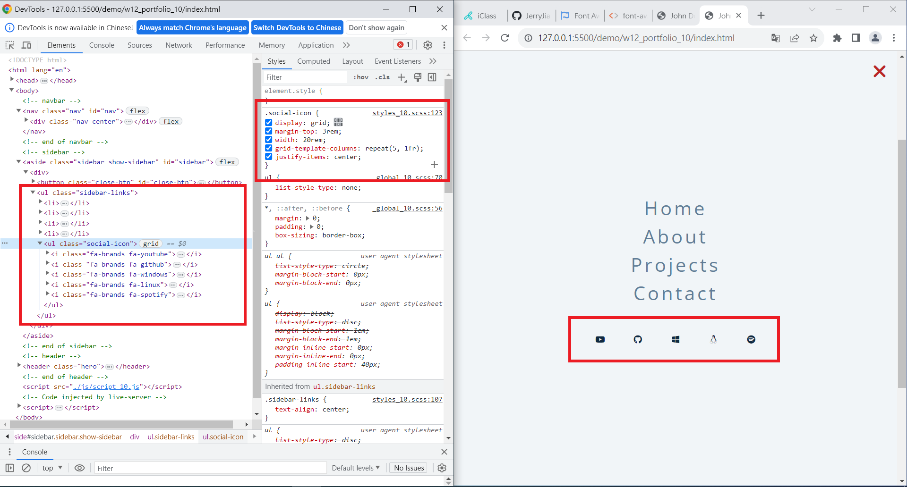

[My Github URL](https://github.com/JerryJiang1015/1121-sweb-demo-212410210.git)
[vercel.app](https://1121-sweb-demo-212410210.vercel.app/)

### W12-P1: Create menu bar with nav links missing



```
6c6523e “JerryJiang1015” Thu Nov 30 19:11:28 2023 +0800  W12-P1: Create menu bar with nav links
missing
```

[vercel.app](https://1121-sweb-demo-212410210.vercel.app/)

### W12-P2: Show nav-links when the screen is greater than 768px


```
a82a39d “JerryJiang1015” Thu Nov 30 19:47:46 2023 +0800  W12-P2: Show nav-links when the screen
is greater than 768px
```

[vercel.app](https://1121-sweb-demo-212410210.vercel.app/)

### W12-P3: Create sidebar by pressing nav-btn, remove sidebar by pressing close-btn


```
ca297e3 “JerryJiang1015” Thu Nov 30 20:34:44 2023 +0800  W12-P3: Create sidebar by pressing nav-btn, remove sidebar by pressing close-btn
```

[vercel.app](https://1121-sweb-demo-212410210.vercel.app/)

### W12-P4: Make nav-btn and close-btn works with navbar-fixed and show-sidebar


```
1ab787f “JerryJiang1015” Thu Nov 30 21:37:18 2023 +0800  W12-P4: Make
nav-btn and close-btn works with navbar-fixed and show-sidebar
```

### W12-P5: Create five social icons in sidebar section



```
b4ca901 “JerryJiang1015” Thu Nov 30 21:41:23 2023 +0800  W12-P5: Create five social icons in sidebar section
```

[vercel.app](https://1121-sweb-demo-212410210.vercel.app/)

### W12-O6: W12 git logs


```
$ git log --pretty=format:"%h%x09%an%x09%ad%x09%s" --after="2023-11-29"
b4ca901 “JerryJiang1015” Thu Nov 30 21:41:23 2023 +0800  W12-P5: Create five social icons in sidebar section
1ab787f “JerryJiang1015” Thu Nov 30 21:37:18 2023 +0800  W12-P4: Make
nav-btn and close-btn works with navbar-fixed and show-sidebar
ca297e3 “JerryJiang1015” Thu Nov 30 20:34:44 2023 +0800  W12-P3: Create sidebar by pressing nav-btn, remove sidebar by pressing close-btn
a82a39d “JerryJiang1015” Thu Nov 30 19:47:46 2023 +0800  W12-P2: Show
nav-links when the screen is greater than 768px
9510b72 “JerryJiang1015” Thu Nov 30 19:46:06 2023 +0800  W12-P1: Create menu bar with nav links missing
```
