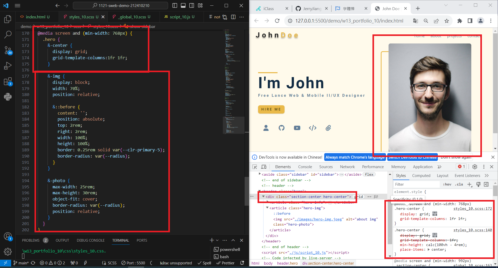
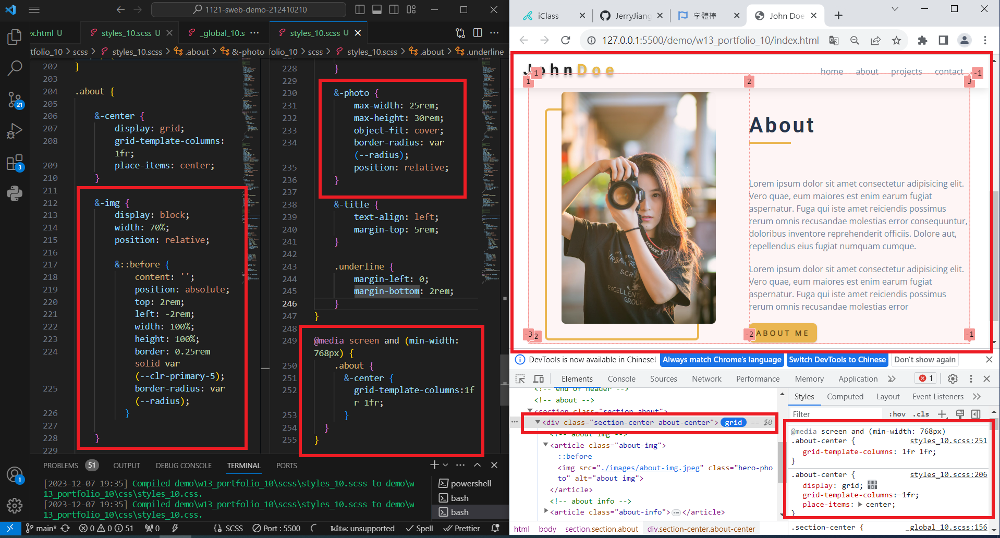
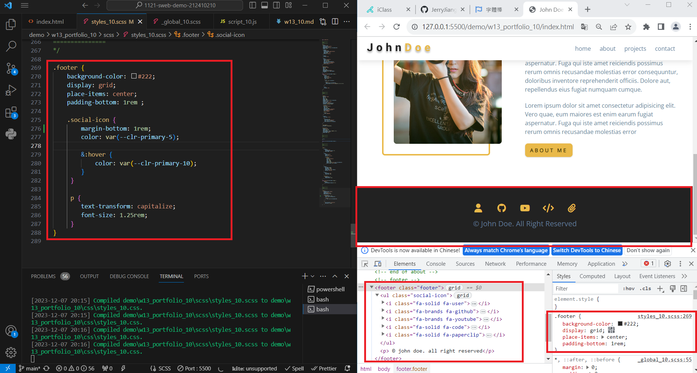
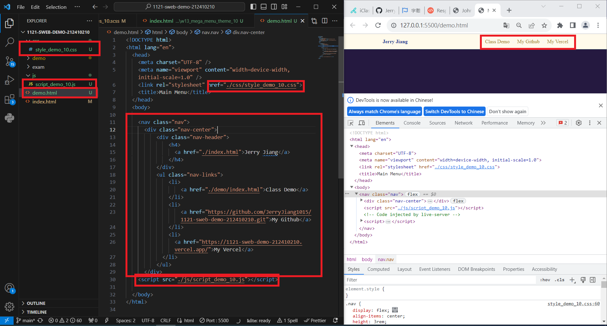
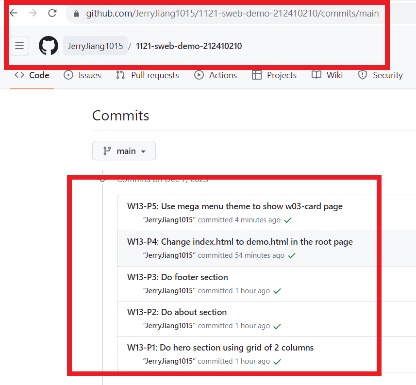

[My Github URL](https://github.com/JerryJiang1015/1121-sweb-demo-212410210.git)
[vercel.app](https://1121-sweb-demo-212410210.vercel.app/)

### W13-P1: Do hero section using grid of 2 columns



```
ab23904 “JerryJiang1015” Thu Dec 7 19:49:39
2023 +0800      W13-P1: Do hero section using grid
of 2 columns
```

[vercel.app](https://1121-sweb-demo-212410210.vercel.app/)

### W13-P2: Do about section



```
2963d7d “JerryJiang1015” Thu Dec 7 19:51:42 2023 +0800   W13-P2: Do about section
```

[vercel.app](https://1121-sweb-demo-212410210.vercel.app/)

### ### W13-P3: Do footer section



```
4e25a44 “JerryJiang1015” Thu Dec 7 20:08:17 2023 +0800   W13-P3: Do footer section
```

[vercel.app](https://1121-sweb-demo-212410210.vercel.app/)

### W13-P4: Change index.html to demo.html in the root page



```
1ab787f “JerryJiang1015” Thu Nov 30 21:37:18 2023 +0800  W13-P4: Make
nav-btn and close-btn works with navbar-fixed and show-sidebar
```

### W13-P5: Create five social icons in sidebar section


```
b4ca901 “JerryJiang1015” Thu Nov 30 21:41:23 2023 +0800  W13-P5: Create five social icons in sidebar section
```

[vercel.app](https://1121-sweb-demo-212410210.vercel.app/)

### W13-O6: W13 git logs



```
$ git log --pretty=format:"%h%x09%an%x09%ad%x09%s" --after="2023-11-29"
b4ca901 “JerryJiang1015” Thu Nov 30 21:41:23 2023 +0800  W13-P5: Create five social icons in sidebar section
1ab787f “JerryJiang1015” Thu Nov 30 21:37:18 2023 +0800  W13-P4: Make
nav-btn and close-btn works with navbar-fixed and show-sidebar
ca297e3 “JerryJiang1015” Thu Nov 30 20:34:44 2023 +0800  W13-P3: Create sidebar by pressing nav-btn, remove sidebar by pressing close-btn
a82a39d “JerryJiang1015” Thu Nov 30 19:47:46 2023 +0800  W13-P2: Show
nav-links when the screen is greater than 768px
9510b72 “JerryJiang1015” Thu Nov 30 19:46:06 2023 +0800  W13-P1: Create menu bar with nav links missing
```
