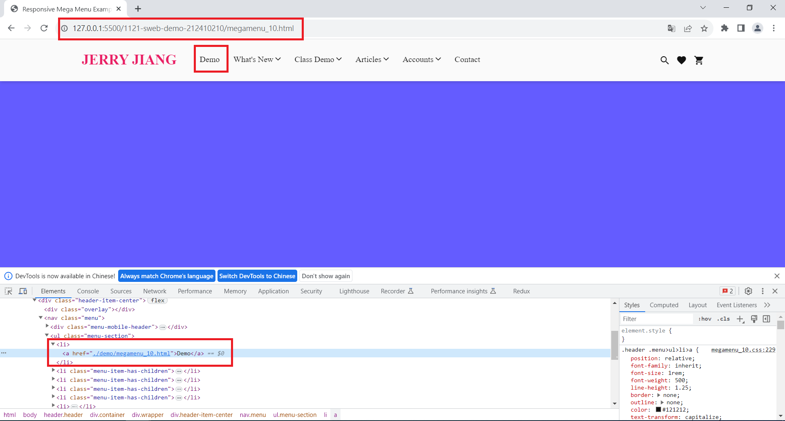
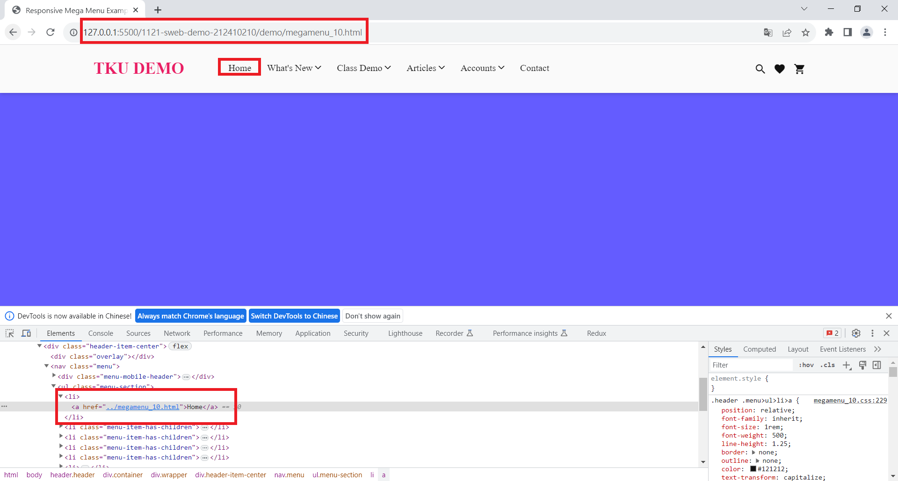
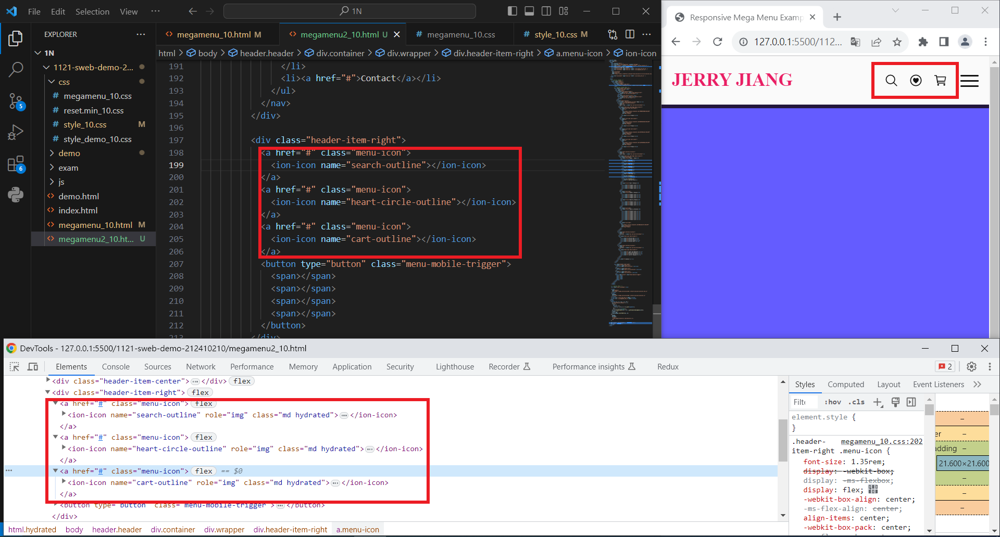
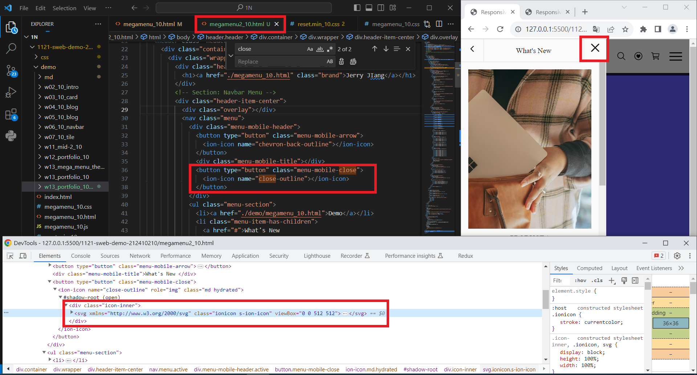
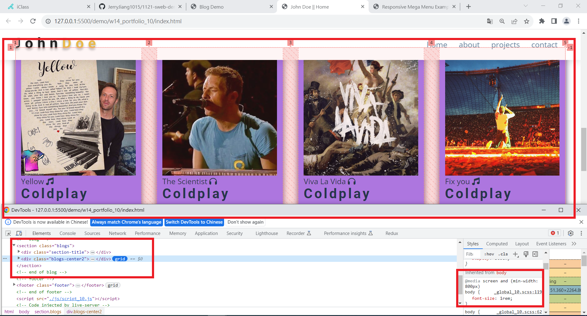
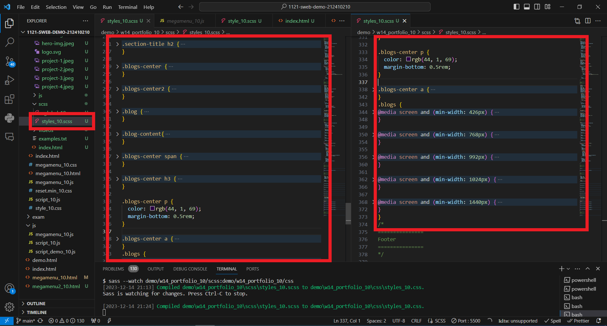
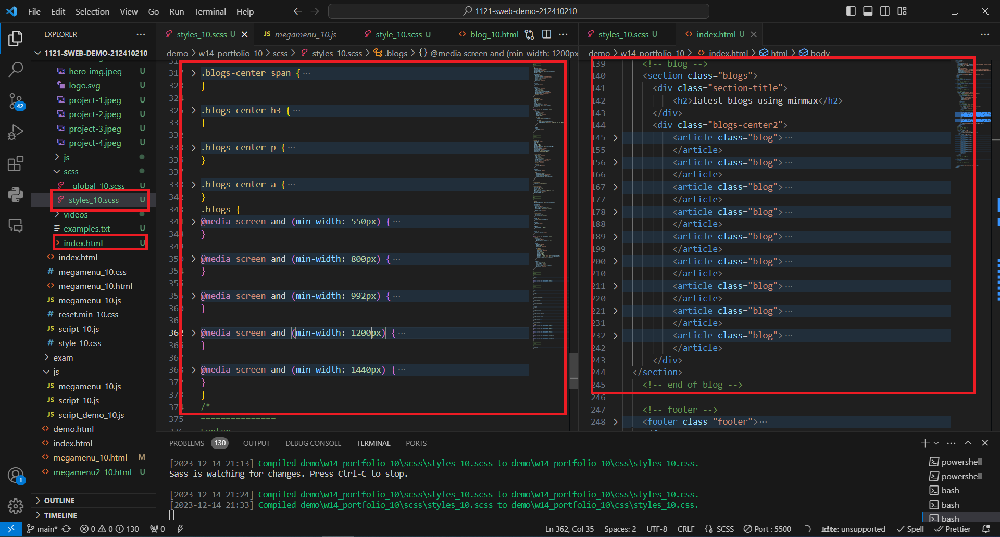
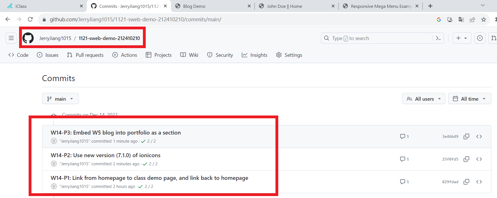

[My Github URL](https://github.com/JerryJiang1015/1121-sweb-demo-212410210.git)
[vercel.app](https://1121-sweb-demo-212410210.vercel.app/)

### W14-P1: Link from homepage to class demo page, and link back to homepage





```
829fdad “JerryJiang1015” Thu Dec 14 19:42:19 2023 +0800  W14-P1: Link from homepage to class demo page, and link back to homepage
```

[vercel.app](https://1121-sweb-demo-212410210.vercel.app/)

### W14-P2: Use new version (7.1.0) of ionicons





```
25f0fd5 “JerryJiang1015” Thu Dec 14 21:38:12 2023 +0800  W14-P2: Use new version (7.1.0) of ionicons
```

[vercel.app](https://1121-sweb-demo-212410210.vercel.app/)

### ### W14-P3: Embed W5 blog into portfolio as a section







```
3e46b49 “JerryJiang1015” Thu Dec 14 21:39:41 2023 +0800  W14-P3: Embed W5 blog into portfolio as a section
```

[vercel.app](https://1121-sweb-demo-212410210.vercel.app/)

### W14-O4: W14 git logs



```
$ git log --pretty=format:"%h%x09%an%x09%ad%x09%s" --after="2023-12-13"
d5afec8 “JerryJiang1015” Thu Dec 14 21:43:38 2023 +0800  W14-O4: W14 git logs
3e46b49 “JerryJiang1015” Thu Dec 14 21:39:41 2023 +0800  W14-P3: Embed W5 blog into portfolio as a section
25f0fd5 “JerryJiang1015” Thu Dec 14 21:38:12 2023 +0800  W14-P2: Use new version (7.1.0) of ionicons
829fdad “JerryJiang1015” Thu Dec 14 19:42:19 2023 +0800  W14-P1: Link from homepage to class demo page, and link back to homepage
```
