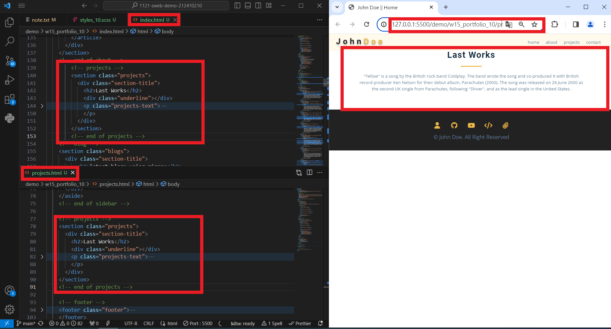
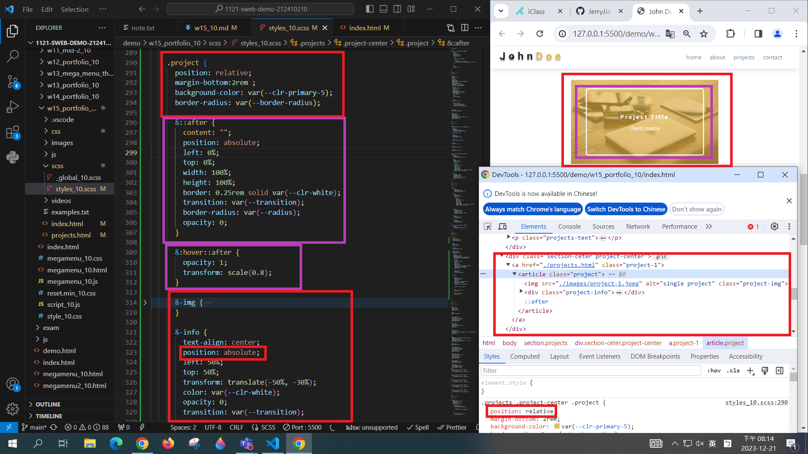
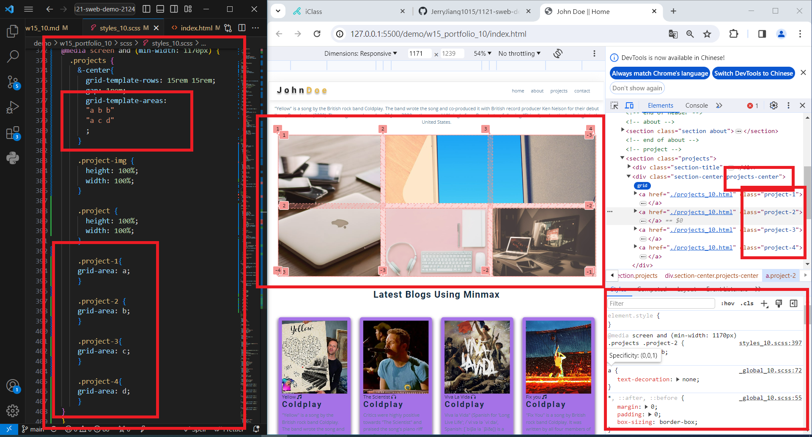
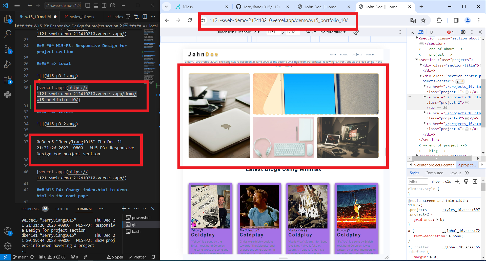
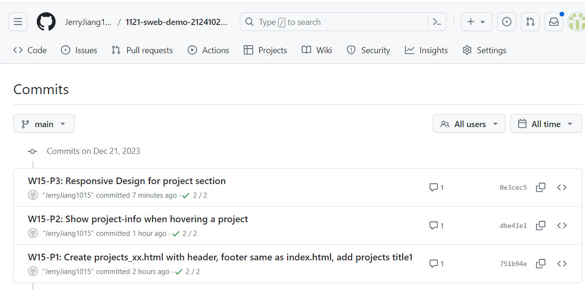

[My Github URL](https://github.com/JerryJiang1015/1121-sweb-demo-212410210.git)
[vercel.app](https://1121-sweb-demo-212410210.vercel.app/)

### W15-P1: Create projects_xx.html with header, footer same as index.html, add projects title



```
751b94e “JerryJiang1015” Thu Dec 21 19:08:18 2023 +0800  W15-P1: Create projects_10.html with header, footer same as index.html, add projects title1
```

[vercel.app](https://1121-sweb-demo-212410210.vercel.app/)

### W15-P2: Show project-info when hovering a project



```
dbe41e1 “JerryJiang1015” Thu Dec 21 20:19:44 2023 +0800  W15-P2: Show project-info when hovering a project
```

[vercel.app](https://1121-sweb-demo-212410210.vercel.app/)

### ### W15-P3: Responsive Design for project section

##### => local



##### => Vercel



```
4e25a44 “JerryJiang1015” Thu Dec 7 20:08:17 2023 +0800   W15-P3: Do footer section
```

[vercel.app](https://1121-sweb-demo-212410210.vercel.app/)

### W15-P4: Change index.html to demo.html in the root page



```
f2f7630 “JerryJiang1015” Thu Dec 7 20:39:54 2023 +0800   W15-P4: Change index.html to demo.html in the root page
```

### W15-P5: Create five social icons in sidebar section


```
f746c80 “JerryJiang1015” Thu Dec 7 21:29:53 2023 +0800   W15-P5: Use mega menu theme to show w03-card page
```

[vercel.app](https://1121-sweb-demo-212410210.vercel.app/)

### W15-O6: W15 git logs


```
$ git log --pretty=format:"%h%x09%an%x09%ad%x09%s" --after="2023-12-06"
f746c80 “JerryJiang1015” Thu Dec 7 21:29:53 2023 +0800   W15-P5: Use mega menu theme to show w03-card page
f2f7630 “JerryJiang1015” Thu Dec 7 20:39:54 2023 +0800   W15-P4: Change index.html to demo.html in the root page
4e25a44 “JerryJiang1015” Thu Dec 7 20:08:17 2023 +0800   W15-P3: Do footer section
2963d7d “JerryJiang1015” Thu Dec 7 19:51:42 2023 +0800   W15-P2: Do about section
ab23904 “JerryJiang1015” Thu Dec 7 19:49:39 2023 +0800   W15-P1: Do hero section using grid of 2 columns
```
