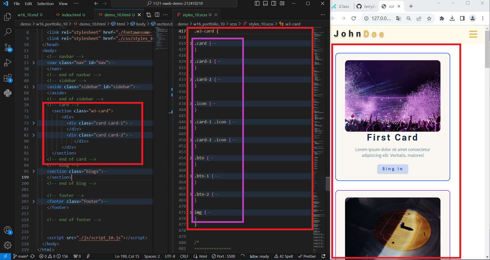
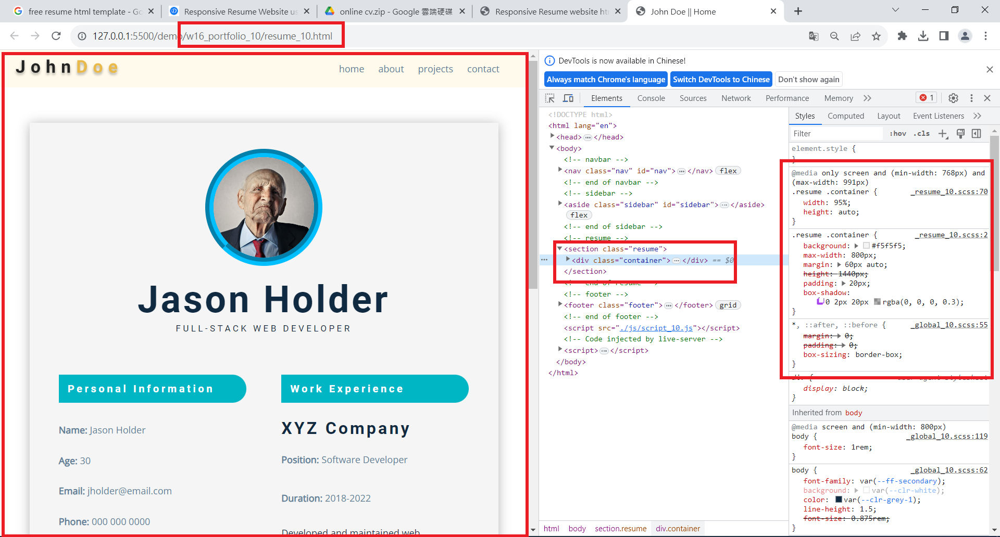
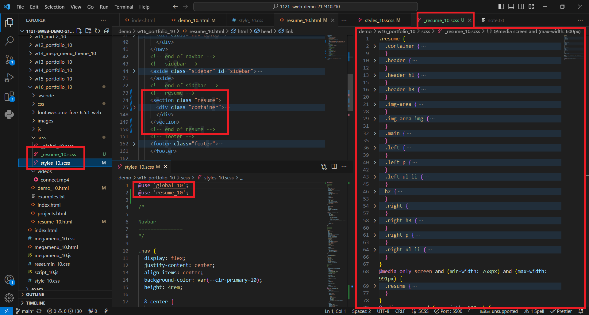
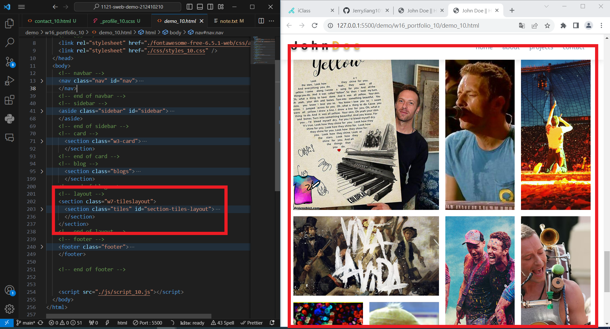
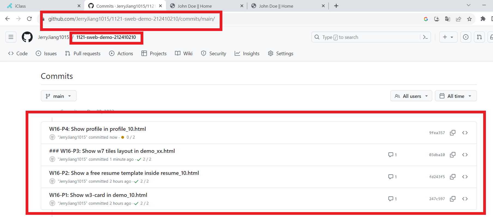

[My Github URL](https://github.com/JerryJiang1015/1121-sweb-demo-212410210.git)
[vercel.app](https://1121-sweb-demo-212410210.vercel.app/)

### W16-P1: Show w3-card in demo_xx.html



```
247c597 “JerryJiang1015” Thu Dec 28 19:01:32 2023 +0800  W16-P1: Show w3-card in demo_10.html
```

[vercel.app](https://1121-sweb-demo-212410210.vercel.app/)

### W16-P2: Show a free resume template inside resume_10.html





```
fd243f5 “JerryJiang1015” Thu Dec 28 19:47:24 2023 +0800  W16-P2: Show a free resume template inside resume_10.html
```

[vercel.app](https://1121-sweb-demo-212410210.vercel.app/)

### ### ### W16-P3: Show w7 tiles layout in demo_10.html



```
0e3cec5 “JerryJiang1015” Thu Dec 21 21:31:26 2023 +0800   W16-P3: Responsive Design for project section
```

[vercel.app](https://1121-sweb-demo-212410210.vercel.app/)

### W16-P4: Show profile in profile_10.html


```
0e3cec5 “JerryJiang1015” Thu Dec 21 21:31:26 2023 +0800   W16-P3: Responsive Design for project section
```

[vercel.app](https://1121-sweb-demo-212410210.vercel.app/)

### W16-O4: W16 git logs



```
$ git log --pretty=format:"%h%x09%an%x09%ad%x09%s" --after="2023-12-20"
0e3cec5 “JerryJiang1015”        Thu Dec 21 21:31:26 2023 +0800  W16-P3: Responsive Design for project section
dbe41e1 “JerryJiang1015”        Thu Dec 21 20:19:44 2023 +0800  W16-P2: Show project-info when hovering a project
751b94e “JerryJiang1015”        Thu Dec 21 19:08:18 2023 +0800  W16-P1: Create projects_xx.html with header, footer same as index.html, add projects title1
```
